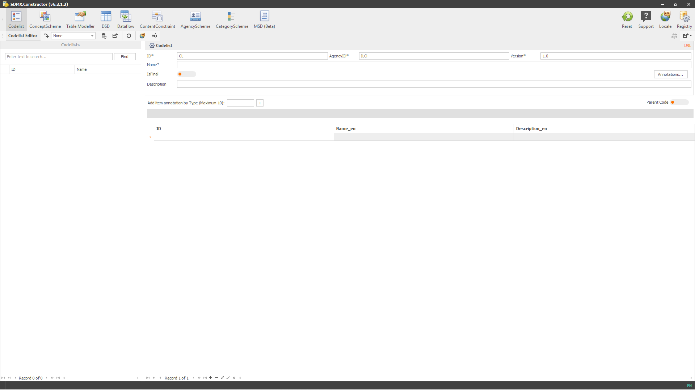
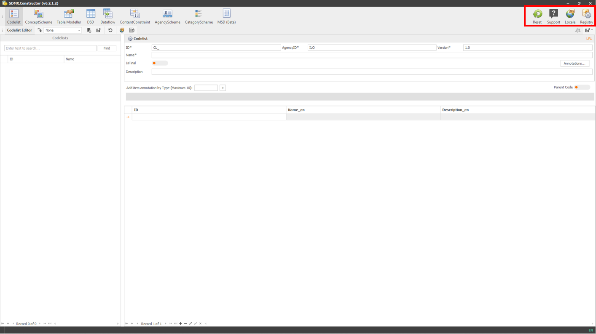

# User Interface {#user-interface}

This chapter will provide you with a comprehensive guide on the main aspects of the SDMX Constructor's user interface. It will cover three main topics. The first topic will be an overview of the user interface, including a detailed explanation of the various menu options, toolbars, and navigation options. The second topic will focus on the inputs and outputs of SDMX Constructor. It will cover the different input options available and the output options. The third topic will provide an overview of the translation functionality in SDMX Constructor.

## Interface overview and navigation

The user interface of the tool appears like this:

```{r 009, echo=FALSE, fig.align="center", out.width="100%"}

```
[Click here to enlarge the image](images/image009.png)

The interface shows many menu items on top. For example, in the top right corner (as highlighted below), the first group of buttons (General Functions) shows the items applicable to the whole tool. They include Reset, Support, Locale and Registry. See Table 3.1 for a brief overview of the menu items.

```{r 011, echo=FALSE, fig.align="center", out.width="100%"}

```
[Click here to enlarge the image](images/image011.png)

| Menu item | What to expect: a bird's-eye view of General Functions                                                                                                          
|-------------------|----------------------------------------------------|
| **Reset**     | The Reset button resets the tool to its default settings. It removes all the inputs and initiates a fresh start.                                            
| **Support**   | The Support button launches the default email application on a computer, with a new email message addressed to the support team for the tool, ready to be composed and sent.                                                                                                                                                            
| **Locale**    | The Support button launches the default email application on a computer, with a new email message addressed to the support team for the tool, ready to be composed and sent.
| **Registry**  | The Registry button provides several options for users to configure their settings. For example, users can specify the connection details of the SDMX registry (either a local folder or local instance (localhost) or online) and connect with the Data Lifecycle Manager (DLM) component of the .Stat Suite. In addition, the button allows specifying the proxy settings for the internet connection if a proxy is needed. There are also options for entering authentication credentials for automated translation using Google Translation or DeepL API. 

: (#tab:table31) A bird's-eye view of the menu items in the top right corner (General Functions)

The second group of menu items (Editors) shows the options in the top left corner (as highlighted below). They include Codelist, ConceptScheme, Table Modeller, DSD, Dataflow, ConceptConstraint, AgencyScheme, CategoryScheme and MSD. Each menu item is an entry point for creating and editing a specific artefact. Clicking on any of the options will reveal more particular options below. See Table 2 for a brief overview of the menu items (Editors). 

```{r 013, echo=FALSE, fig.align="center", out.width="100%"}

```
[Click here to enlarge the image](images/image013.png)

table

The third group of menu items (Editor Ribbon) are in the top left corner and below the second group of menu items (as highlighted below). 

```{r 015, echo=FALSE, fig.align="center", out.width="100%"}

```
[Click here to enlarge the image](images/image015.png)

It contains icons that represent the most commonly used features of the selected options above, and hovering over each icon will reveal a tooltip that describes its function. The options available in this group of menu items change according to the menu item selected on the top menu. 

Below are the icons representing the menu items (Editor Ribbon) and their functions. Users can change the size of these icons by right-clicking on any of them, selecting Customize, and selecting the appropriate setting in Options.

table

If a user chooses “Codelist” from the top menu, the corresponding menu items in the third group will appear as “Load from registry” (from the dropdown menu), “Refresh the registry”, “Import”, “Reset the current Editor inputs”, “Translation Service”, and “Bulk load”. 

However, suppose a user selects “ConceptScheme” from the top menu instead. In that case, the user will see three additional options: “Add New Concept”, “Load Concept”, and “Delete Selected Concepts” relevant to the chosen menu item at the top, i.e., “ConceptScheme”.

All options available within this menu group per the item selected on the top menu are listed below.

image

The fourth menu item group (Preview and Export) is in the top right corner and below the first group of menu items (as highlighted below). 

image

The options available in this group of menu items are related to the preview and export functionalities of the tool and change according to the menu item selected on the top menu (the second group of menu items (Editors)). 

Below are the icons representing the menu items, along with their features. Users can change the size of these icons by right-clicking on any of them, selecting Customize, and selecting the appropriate setting in Options.

table

The following section explains the working area of the tool. 

Below the menu items on top, the user interface appears divided into two main parts. First, the left pane on the interface serves as a space to hold the artefacts’ list. The other side is designated to showcase relevant details (both sides are highlighted in different colours in the screenshot below). Selecting (by double-clicking) an artefact from the left pane prompts its details to appear on the screen’s right-side pane. This layout is available for Codelist, Dataflow and ContentConstraint.

image

For ConceptScheme, Table Modeller, DSD, AgencyScheme, CategoryScheme, and MSD, an additional pane also appears in the user interface (below the placeholder for listing the artefacts - (as heightened below)), which acts as a staging area (or a pool). It becomes a CONCEPTS POOL for ConceptScheme, Table Modeller, DSD and MSD options. And it turns into an AGENCY POOL for AgencyScheme and a CATEGORY POOL for CategoryScheme options. 

The users can drag the artefacts back and forth between the pool area and the pane on the right.

image


## Input and output methods

## Translation
