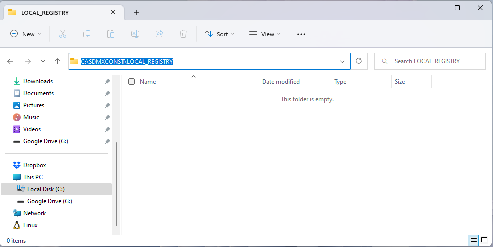
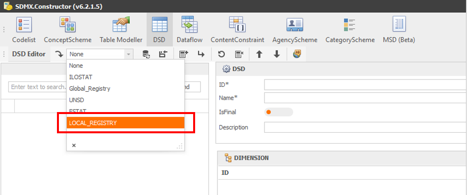

# Using SDMX Constructor {#using-sdmx}

Welcome to the chapter on using SDMX Constructor! This chapter will cover three key topics that will help you make the most of this powerful tool.

The first topic we will cover is how to use SDMX Constructor to access SDMX artefacts from SDMX registries. This will include step-by-step instructions on how to use the tool to connect to a registry, browse its contents, and download the artefacts you need.

Next, we will dive into how to use SDMX Constructor to create new SDMX artefacts from scratch. Whether you need to create a new concept scheme, code list or DSD, SDMX Constructor provides a simple and intuitive interface to help you get the job done.

Finally, we will explore how to use SDMX Constructor to work with .Stat Suite. This powerful platform is designed to help you analyse, visualise, and disseminate statistical data, and SDMX Constructor is the perfect complement to help you access and work with the SDMX artefacts you need.

By the end of this chapter, you will have a solid understanding of how to use SDMX Constructor to access, create, and work with SDMX artefacts, and you will be well on your way to becoming an expert in this powerful tool. So, let’s get started!


## Accessing SDMX artefacts from registries {#accessing-sdmx}

In this section, we will walk you through the process of using SDMX Constructor on your computer to access and view the SDMX artefacts from the SDMX registries. This will enable you to easily browse and download the artefacts you need, for example, from the default registries already available in the SDMX Constructor.

### Default SDMX registries

You can use the SDMX Constructor on your computer to access and view the SDMX artefacts from the SDMX registries. By default, SDMX Constructor offers the following registries to access SDMX artefacts: SDMX Global Registry: (https://registry.sdmx.org/), United Nations Statistics Division (UNSD): (https://data.un.org/WS), the Italian National Institute of Statistics (ESTAT) and the ILO Department of Statistics (ILOSTAT): (https://www.ilo.org/sdmx/index.html). You can view these by going to the Registry button and opening the Registry Name dropdown in the SDMX Registry tab, as shown below.

```{r 044, echo=FALSE, fig.align="center", out.width="100%"}
knitr::include_graphics("./images/image044.png")
```
[Click here to enlarge the image](images/image044.png)

As shown below, select a registry from the dropdown option to load the artefacts.

```{r 046, echo=FALSE, fig.align="center", out.width="100%"}
knitr::include_graphics("./images/image046.png")
```
[Click here to enlarge the image](images/image046.png)

## Creating SDMX artefacts from scratch {#creating-sdmx}

Using SDMX Constructor, you can create new SDMX artefacts from scratch. 

### Setting up a registry as a local folder {#setting-up}

You can use the SDMX Constructor to create SDMX artefacts on your computer without a complicated setup. You can start using it with a local folder on your computer. Following are the steps to set up a registry in a computer’s local folder. 

- On your computer, create a folder, and let’s call it LOCAL_REGISTRY. The screenshot below shows that the folder is created within the C drive. 

```{r 048, echo=FALSE, fig.align="center", out.width="100%"}

```
[Click here to enlarge the image](images/image048.png)

-	Start the SDMX Constructor.
-	Click on the Registry button on the SDMX Constructor. It will open a pop-up window showing the default entries in the SDMX Registry tab.

```{r 050, echo=FALSE, fig.align="center", out.width="100%"}
knitr::include_graphics("./images/image050.png")
```
[Click here to enlarge the image](images/image050.png)

-	In the pop-up window, there are only two fields where we need to make changes: Registry Name and Base URL. You can click the ‘New’ button (which will clear the fields) or type directly within the fields. 
-	For Registry Name, please type the name of the folder we created before LOCAL_REGISTRY.
-	For the Base URL, get the path of the folder (shown below). 

```{r 052, echo=FALSE, fig.align="center", out.width="100%"}

```
[Click here to enlarge the image](images/image052.png)

-	After entries in two fields, the pop-up window will look like this:

```{r 054, echo=FALSE, fig.align="center", out.width="100%"}
knitr::include_graphics("./images/image054.png")
```
[Click here to enlarge the image](images/image054.png)

-	Hit Save. It will generate a confirmation message, as shown below.

```{r 056, echo=FALSE, fig.align="center", out.width="100%"}

```
[Click here to enlarge the image](images/image056.png)

-	Press OK to confirm. The pop-up windows will go away. 
-	To confirm if the folder is accessible from the tool, in the Editor Ribbon area, if you go to the ‘Load from registry’ option, you will see the LOCAL_REGISTRY in the dropdown options.

```{r 058, echo=FALSE, fig.align="center", out.width="100%"}

```
[Click here to enlarge the image](images/image058.png)

-	The setup with a local folder is complete. 


### Preparing inputs {#preparing-inputs}

### Creating AgencyScheme {#creating-agencyscheme}

### Creating ConceptScheme & Codelist {#creating-conceptscheme}

### Creating DSD, Dataflow, ContentConstraint and CategoryScheme {#creating-dsd}

## Working with .Stat Suite

The tool works as a back-end of the .Stat Suite. In two ways. 

### Uploading XML file to the Data Lifecycle Manager (DLM) {#upload-the}

### Connect to a new SDMX registry {#connect-to}

