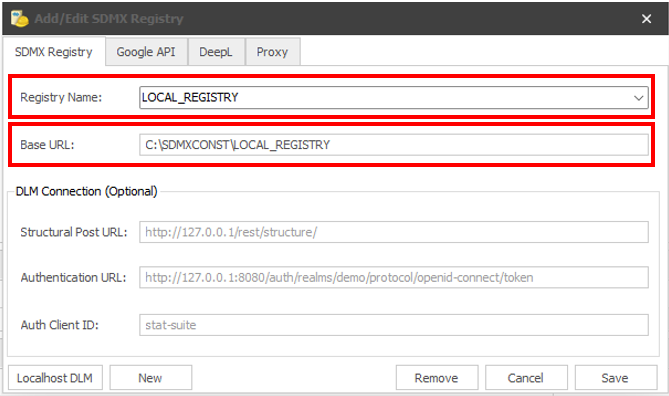
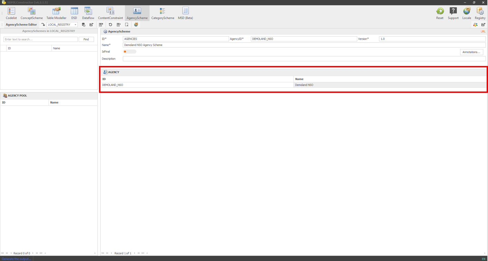
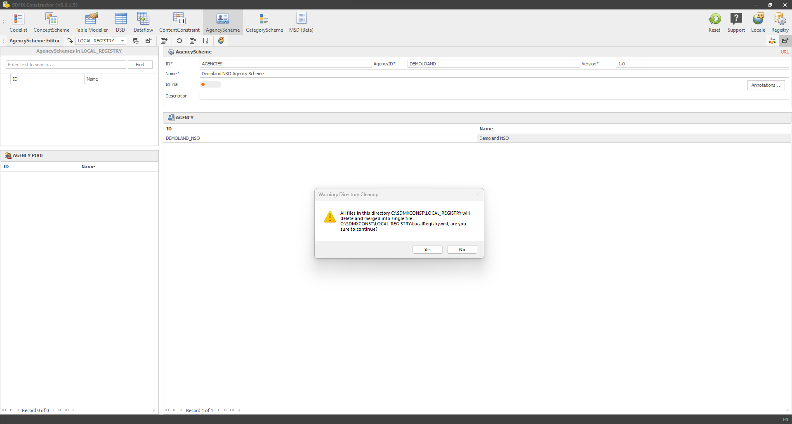
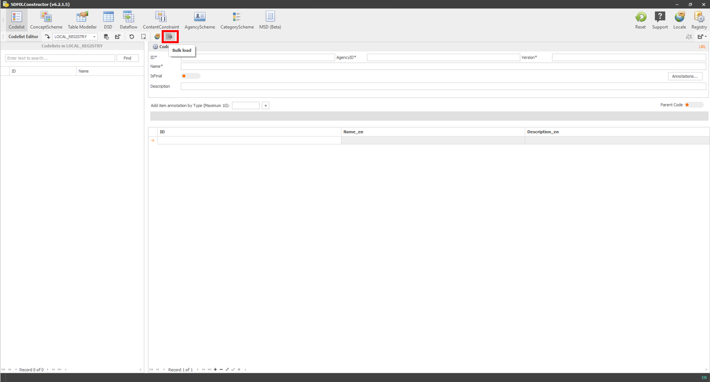
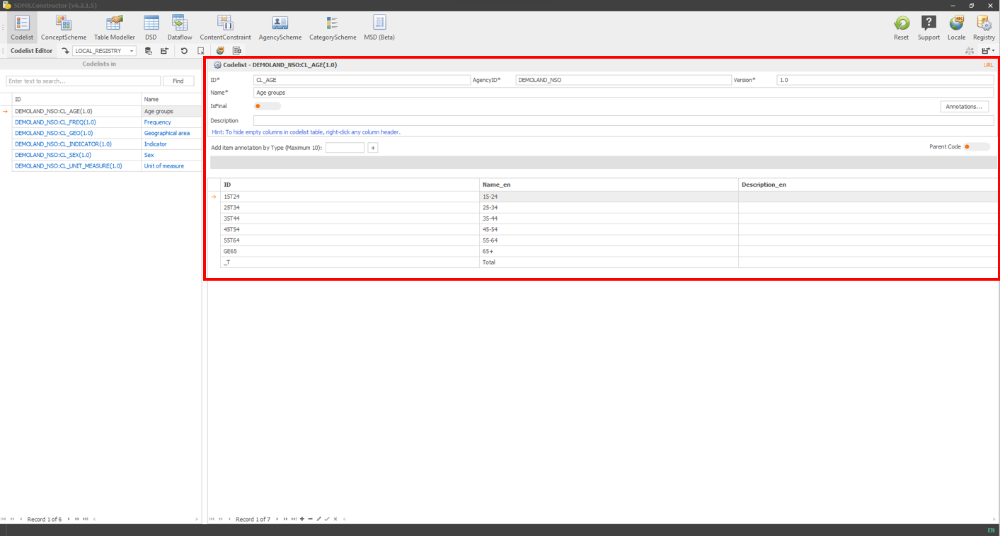
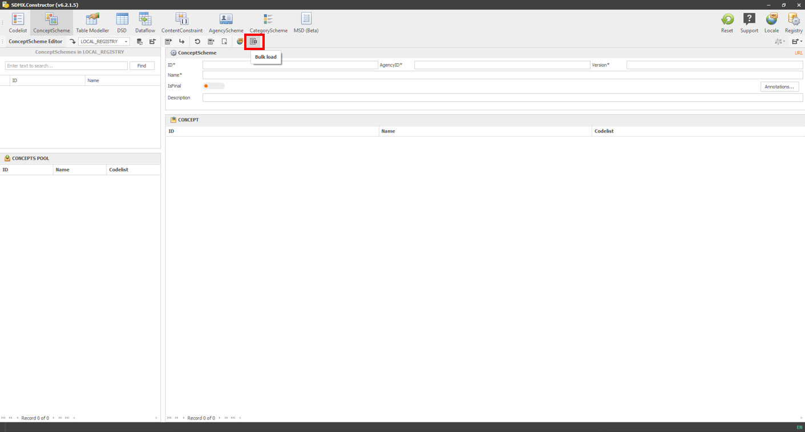
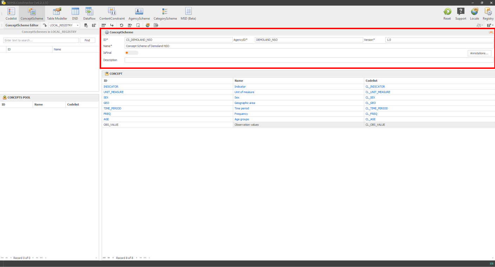

# Using SDMX Constructor {#using-sdmx}

Welcome to the chapter on using SDMX Constructor! This chapter will cover three key topics that will help you make the most of this powerful tool.

The first topic we will cover is how to use SDMX Constructor to access SDMX artefacts from SDMX registries. This will include step-by-step instructions on how to use the tool to connect to a registry, browse its contents, and download the artefacts you need.

Next, we will dive into how to use SDMX Constructor to create new SDMX artefacts from scratch. Whether you need to create a new concept scheme, code list or DSD, SDMX Constructor provides a simple and intuitive interface to help you get the job done.

Finally, we will explore how to use SDMX Constructor to work with .Stat Suite. This powerful platform is designed to help you analyse, visualise, and disseminate statistical data, and SDMX Constructor is the perfect complement to help you access and work with the SDMX artefacts you need.

By the end of this chapter, you will have a solid understanding of how to use SDMX Constructor to access, create, and work with SDMX artefacts, and you will be well on your way to becoming an expert in this powerful tool. So, let's get started!

## Accessing SDMX artefacts from registries {#accessing-sdmx}

In this section, we will walk you through the process of using SDMX Constructor on your computer to access and view the SDMX artefacts from the SDMX registries. This will enable you to easily browse and download the artefacts you need, for example, from the default registries already available in the SDMX Constructor.

**Default SDMX registries**

You can use the SDMX Constructor on your computer to access and view the SDMX artefacts from the SDMX registries. By default, SDMX Constructor offers the following registries to access SDMX artefacts: SDMX Global Registry: (<https://registry.sdmx.org/>), United Nations Statistics Division (UNSD): (<https://data.un.org/WS>), the Italian National Institute of Statistics (ESTAT) and the ILO Department of Statistics (ILOSTAT): (<https://www.ilo.org/sdmx/index.html>). You can view these by going to the Registry button and opening the Registry Name dropdown in the SDMX Registry tab, as shown below.

```{r 044, echo=FALSE, fig.align="center", out.width="100%"}
knitr::include_graphics("./images/image044.png")
```
[Click here to enlarge the image](images/image044.png)

As shown below, select a registry from the dropdown option to load the artefacts.

```{r 046, echo=FALSE, fig.align="center", out.width="100%"}
knitr::include_graphics("./images/image046.png")
```
[Click here to enlarge the image](images/image046.png)

## Setting up a registry as a local folder {#setting-up}

You can use the SDMX Constructor to create SDMX artefacts on your computer without a complicated setup. You can start using it with a local folder on your computer. Following are the steps to set up a registry in a computer's local folder.

-   On your computer, create a folder, and let's call it LOCAL_REGISTRY. The screenshot below shows that the folder is created within the C drive.

```{r 048, echo=FALSE, fig.align="center", out.width="100%"}
knitr::include_graphics("./images/image048.png")
```
[Click here to enlarge the image](images/image048.png)

-   Start the SDMX Constructor.
-   Click on the Registry button on the SDMX Constructor. It will open a pop-up window showing the default entries in the SDMX Registry tab.

```{r 050, echo=FALSE, fig.align="center", out.width="100%"}
knitr::include_graphics("./images/image050.png")
```
[Click here to enlarge the image](images/image050.png)

-   In the pop-up window, there are only two fields where we need to make changes: Registry Name and Base URL. You can click the 'New' button (which will clear the fields) or type directly within the fields.
-   For Registry Name, please type the name of the folder we created before LOCAL_REGISTRY.
-   For the Base URL, get the path of the folder (shown below).

```{r 052, echo=FALSE, fig.align="center", out.width="100%"}
knitr::include_graphics("./images/image052.png")
```
[Click here to enlarge the image](images/image052.png)

-   After entries in two fields, the pop-up window will look like this:

```{r 054, echo=FALSE, fig.align="center", out.width="100%"}

```
[Click here to enlarge the image](images/image054.png)

-   Hit Save. It will generate a confirmation message, as shown below.

```{r 056, echo=FALSE, fig.align="center", out.width="100%"}
knitr::include_graphics("./images/image056.png")
```
[Click here to enlarge the image](images/image056.png)

-   Press OK to confirm. The pop-up windows will go away.
-   To confirm if the folder is accessible from the tool, in the Editor Ribbon area, if you go to the 'Load from registry' option, you will see the LOCAL_REGISTRY in the dropdown options.

```{r 058, echo=FALSE, fig.align="center", out.width="100%"}
knitr::include_graphics("./images/image058.png")
```
[Click here to enlarge the image](images/image058.png)

-   The setup with a local folder is complete.

## Preparing inputs {#preparing-inputs}

To demonstrate the key functionalities of the SDMX Constructor, it is helpful to have a dummy dataset modelled appropriately.

Imagine a country called Demoland and its National Statistical Office (NSO), Demoland NSO. Imagine the Demoland NSO is creating SDMX artefacts for its data in the following two tables.

| Region           | Sex        | 2015 | 2016 | 2017 | 2018 | 2019 |
|------------------|------------|------|------|------|------|------|
| Cities and Towns | Men        | 14.4 | 14.4 | 14   | 13.1 | 12.5 |
| Cities and Towns | Women      | 20.7 | 21   | 21   | 21   | 21   |
| Cities and Towns | Both sexes | 17.6 | 17.2 | 17.8 | 17.2 | 17.2 |
| Urban Villages   | Men        | 27.8 | 28.2 | 28   | 28   | 28   |
| Urban Villages   | Women      | 30.3 | 29.4 | 29.8 | 30   | 30   |
| Urban Villages   | Both sexes | 29.1 | 29.1 | 28.8 | 29.6 | 29.4 |
| Rural Areas      | Men        | 26.2 | 26.2 | 26.1 | 26.9 | 27.2 |
| Rural Areas      | Women      | 29.6 | 29.5 | 29.5 | 29.5 | 28.6 |
| Rural Areas      | Both sexes | 28   | 27.1 | 27.1 | 26.9 | 27.4 |
| Total            | Men        | 24   | 24   | 23.7 | 23.7 | 24.2 |
| Total            | Women      | 27.9 | 27.9 | 28.7 | 28.3 | 28.3 |
| Total            | Both sexes | 26   | 26   | 26   | 26.2 | 26.2 |

: (#tab:table41) Unemployment Rate by sex and region


| Age Group | Men    | Women  | Both Sexes |
|-----------|--------|--------|------------|
| 15-24     | 130,088| 133,770| 263,856    |
| 25-34     | 33,165 | 60,240 | 93,405     |
| 35-44     | 21,970 | 38,944 | 60,914     |
| 45-54     | 18,631 | 36,403 | 55,034     |
| 55-64     | 26,821 | 44,010 | 70,831     |
| 65+       | 45,323 | 78,725 | 124,048    |
| Total     | 275,997| 392,092| 668,088    |

: (#tab:table42) Population outside the labour force by sex and age group (2022)

After modelling the data in both tables, we have the following ConceptScheme and Codelist arranged below. Note that the order of the columns in the following tables is per the SDMX Constructor’s bulk load default templates (ConceptScheme and Codelist).

**ConceptScheme:**

| Concept ID   | Concept Name       | Description                                                             | Codelist ID   |
|--------------|--------------------|------------------------------------------------------------------------|---------------|
| INDICATOR    | Indicator          | Refers to statistical measure describing a particular aspect of a social, economic or environmental phenomenon | CL_INDICATOR  |
| UNIT_MEASURE | Unit of measure    | Unit in which the observation values are expressed                      | CL_UNIT_MEASURE |
| SEX          | Sex                | State of being male or female                                           | CL_SEX         |
| GEO          | Geographic area    | Refers to Urban or Rural locations                                      | CL_GEO         |
| TIME_PERIOD  | Time period        | Timespan or point in time to which the observation refers                | CL_TIME_PERIOD |
| FREQ         | Frequency          | Time interval at which observations occur over a given time period      | CL_FREQ        |
| AGE          | Age groups         | Length of time that an entity has lived or existed                       | CL_AGE         |
| OBS_VALUE    | Observation values | Refers to data or observation values                                    | CL_OBS_VALUE  |

: (#tab:table43) ConceptScheme

**Codelist:**

| Codelist ID   | Concept Name       | Code ID | Code Name                                       |
|---------------|--------------------|---------|------------------------------------------------|
| CL_INDICATOR  | Indicator          | UNER    | Unemployment Rate                              |
| CL_INDICATOR  | Indicator          | POLF    | Population outside the labour force            |
| CL_UNIT_MEASURE | Unit of measure   | RT      | Rate                                           |
| CL_UNIT_MEASURE | Unit of measure   | PS      | Persons                                        |
| CL_SEX        | Sex                | M       | Men                                            |
| CL_SEX        | Sex                | F       | Women                                          |
| CL_SEX        | Sex                | _T      | Both Sexes (Total)                             |
| CL_GEO        | Geographical area | M       | Cities and Towns (Metropolitan Area)            |
| CL_GEO        | Geographical area | U       | Urban Villages                                 |
| CL_GEO        | Geographical area | R       | Rural Areas                                    |
| CL_GEO        | Geographical area | _T      | Total                                          |
| CL_FREQ       | Frequency         | A       | Annual                                         |
| CL_AGE        | Age groups        | 15T24   | 15-24                                          |
| CL_AGE        | Age groups        | 25T34   | 25-34                                          |
| CL_AGE        | Age groups        | 35T44   | 35-44                                          |
| CL_AGE        | Age groups        | 45T54   | 45-54                                          |
| CL_AGE        | Age groups        | 55T64   | 55-64                                          |
| CL_AGE        | Age groups        | GE65    | 65+                                            |
| CL_AGE        | Age groups        | _T      | Total                                          |

: (#tab:table44) Codelist

We will use these dummy datasets in this user manual to illustrate some critical functionalities of SDMX Constructor. 

## Creating AgencyScheme {#creating-agencyscheme}

-	Start the SDMX Constructor, click the AgencyScheme button on top, and select the folder we created before, LOCAL_REGISTRY, from the AgencyScheme Editor’s ‘Load from registry’ dropdown option, as shown below.

```{r 060, echo=FALSE, fig.align="center", out.width="100%"}
knitr::include_graphics("./images/image060.png")
```
[Click here to enlarge the image](images/image060.png)

-	Create an AgencyScheme by entering the ID, AgencyID, Version and Name in the fields as shown below. For this exercise, we will have only Demoland NSO as an agency (all data are from Demoland NSO). We will do it in two stages. First, we will enter the properties for the AgencyScheme and then create the agency. 


> **Note on IDs and versions**: All SDMX artefacts, have a unique identifier: In case of AgencySchme these are Agency ID, ID, and Version. Each artefact is assigned a specific version number to keep track of changes and avoid conflicts. This makes sure that the artefacts are managed efficiently and can be easily shared and reused by others while also giving users control over the artefacts they create.


-	For ID, enter AGENCIES; For AgencyID, enter Demoland_NSO; for version, enter 1.0; and for the Name, enter Demoland NSO Agency Scheme as shown below.

```{r 062, echo=FALSE, fig.align="center", out.width="100%"}
knitr::include_graphics("./images/image062.png")
```
[Click here to enlarge the image](images/image062.png)

-	Now, we create the agency (as part of the AgencyScheme) by clicking on ‘Add New Agency’ as shown below.

```{r 064, echo=FALSE, fig.align="center", out.width="100%"}
knitr::include_graphics("./images/image064.png")
```
[Click here to enlarge the image](images/image064.png)

-	Clicking on ‘Add New Agency’ will open a pop-up window. We create the Demoland NSO agency by entering DEMOLAND_NSO in the ID and Demoland NSO in the Name field in the Add Agency pop-up and clicking Apply (as shown below).

```{r 066, echo=FALSE, fig.align="center", out.width="100%"}
knitr::include_graphics("./images/image066.png")
```
[Click here to enlarge the image](images/image066.png)

-	Once we finished creating the agency, it would look like the following (the agency will be in the AGENCY POOL).

```{r 068, echo=FALSE, fig.align="center", out.width="100%"}
knitr::include_graphics("./images/image068.png")
```
[Click here to enlarge the image](images/image068.png)

-	Move the agency from the AGENCY POOL to the AGENCY space on the right pane by selecting and dragging it. After the move, it would look like the following.

```{r 070, echo=FALSE, fig.align="center", out.width="100%"}

```
[Click here to enlarge the image](images/image070.png)

-	Click the Export button highlighted below to save the agency scheme in the folder.

```{r 072, echo=FALSE, fig.align="center", out.width="100%"}
knitr::include_graphics("./images/image072.png")
```
[Click here to enlarge the image](images/image072.png)

-	As shown below, a pop-up window will open to confirm the saving location.

```{r 074, echo=FALSE, fig.align="center", out.width="100%"}
knitr::include_graphics("./images/image074.png")
```
[Click here to enlarge the image](images/image074.png)

-	Clicking on Save will prompt another message (“All files in this directory (path) with delete and merged into a single file (path) are you sure to continue?”), as shown below.

```{r 076, echo=FALSE, fig.align="center", out.width="100%"}

```
[Click here to enlarge the image](images/image076.png)

-	Clicking on Yes will create and save an XML file in the folder we created before, as shown below.

```{r 078, echo=FALSE, fig.align="center", out.width="100%"}
knitr::include_graphics("./images/image078.png")
```
[Click here to enlarge the image](images/image078.png)

-	Opening the file (LocalRegistry.xml) will show the agency scheme, as shown in the image below. 

```{r 080, echo=FALSE, fig.align="center", out.width="100%"}
knitr::include_graphics("./images/image080.png")
```
[Click here to enlarge the image](images/image080.png)


## Creating ConceptScheme & Codelist {#creating-conceptscheme}

We do this in one go. But first, we will upload the Codelist and then the ConceptScheme. 

**Create Codelist:**

-	Click on the Codelist button on top and ensure that the folder we created before, LOCAL_REGISTRY, is selected from the Codelist Editor’s ‘Load from registry’ dropdown option, as shown below.

```{r 082, echo=FALSE, fig.align="center", out.width="100%"}
knitr::include_graphics("./images/image082.png")
```
[Click here to enlarge the image](images/image082.png)

-	Click on the Bulk load button as shown below.
 
```{r 084, echo=FALSE, fig.align="center", out.width="100%"}

```
[Click here to enlarge the image](images/image084.png)

-	It will open up a pop-up window, as shown below.
 
```{r 086, echo=FALSE, fig.align="center", out.width="100%"}
knitr::include_graphics("./images/image086.png")
```
[Click here to enlarge the image](images/image086.png)

-	Copy the Codelist table we prepared before and paste its contents here. Before pasting, remember to click on the ID column (shown in white in the image below). Then, select the entire row (by clicking on the little arrow (pointing at the right) at the beginning of the rows).
 
```{r 088, echo=FALSE, fig.align="center", out.width="100%"}
knitr::include_graphics("./images/image088.png")
```
[Click here to enlarge the image](images/image088.png)

-	After pasting, remember to delete the header row. You can do this by selecting the entire row (by clicking again the little arrow pointing at the right at the beginning of the rows) and clicking the button (“-”) below, as indicated by a downward red arrow. 
 
```{r 090, echo=FALSE, fig.align="center", out.width="100%"}
knitr::include_graphics("./images/image090.png")
```
[Click here to enlarge the image](images/image090.png)

-	Enter the Agency ID and Version on the top row as DEMOLAND_NSO and 1.0, respectively, as shown below. If only the top row contains entries (DEMOLAND_NSO and 1.0) and the rest is empty, it implies that the Agency ID and Version are repeated for each row.
 
```{r 092, echo=FALSE, fig.align="center", out.width="100%"}
knitr::include_graphics("./images/image092.png")
```
[Click here to enlarge the image](images/image092.png)

-	Click on Load, as shown below.

```{r 094, echo=FALSE, fig.align="center", out.width="100%"}
knitr::include_graphics("./images/image094.png")
```
[Click here to enlarge the image](images/image094.png)

-	After the loading, this is how it would look (as shown below).

```{r 096, echo=FALSE, fig.align="center", out.width="100%"}
knitr::include_graphics("./images/image096.png")
```
[Click here to enlarge the image](images/image096.png)

-	Clicking on any item on this list will show the details on the right pane, as shown below.
 
```{r 098, echo=FALSE, fig.align="center", out.width="100%"}

```
[Click here to enlarge the image](images/image098.png)

**Create ConceptScheme:**

-	Click on the ConceptScheme button on top and ensure that the folder we created before, LOCAL_REGISTRY, is selected from the ConceptScheme Editor’s ‘Load from registry’ dropdown option, as shown below.
 
```{r 100, echo=FALSE, fig.align="center", out.width="100%"}
knitr::include_graphics("./images/image100.png")
```
[Click here to enlarge the image](images/image100.png)

-	Click on the Bulk load button, as shown below.
 
```{r 102, echo=FALSE, fig.align="center", out.width="100%"}

```
[Click here to enlarge the image](images/image102.png)

-	It will open up a pop-up window, as shown below.
 
```{r 104, echo=FALSE, fig.align="center", out.width="100%"}
knitr::include_graphics("./images/image104.png")
```
[Click here to enlarge the image](images/image104.png)

-	Copy the ConceptScheme table we prepared before and paste its contents here. Before pasting, remember to click on the ID column and select the entire row (by clicking on the little arrow at the beginning of the rows).
 
```{r 106, echo=FALSE, fig.align="center", out.width="100%"}
knitr::include_graphics("./images/image106.png")
```
[Click here to enlarge the image](images/image106.png)

-	After pasting, remember to delete the header row by selecting the entire row and using the button (“-”) below, as indicated by a downward red arrow. 
 
```{r 108, echo=FALSE, fig.align="center", out.width="100%"}
knitr::include_graphics("./images/image108.png")
```
[Click here to enlarge the image](images/image108.png)

-	Click on Load, as shown below.

```{r 110, echo=FALSE, fig.align="center", out.width="100%"}
knitr::include_graphics("./images/image110.png")
```
[Click here to enlarge the image](images/image110.png)

-	After loading, the concepts will be visible in the CONCEPT POOL, as shown below.
 
```{r 112, echo=FALSE, fig.align="center", out.width="100%"}
knitr::include_graphics("./images/image112.png")
```
[Click here to enlarge the image](images/image112.png)

-	Move all the concepts from the CONCEPT POOL to the CONCEPT pane by selecting all (ctrl + a), then dragging and dropping. After the move, it would look like the following.
 
```{r 114, echo=FALSE, fig.align="center", out.width="100%"}
knitr::include_graphics("./images/image114.png")
```
[Click here to enlarge the image](images/image114.png)

-	After moving the concepts, enter the details: (ID: CS_DEMOLAND_NSO, AgencyID: DEMOLAND_NSO, Version: 1.0, and Name: Concept Scheme of Demoland NSO) for the ConceptScheme, as shown below.

```{r 116, echo=FALSE, fig.align="center", out.width="100%"}

```
[Click here to enlarge the image](images/image116.png)

-	Then, click the ‘Save with descendants’ from the save option as shown below. This option, ‘Save with descendants, ’ will save the concept scheme with the codelist. 
 
```{r 118, echo=FALSE, fig.align="center", out.width="100%"}
knitr::include_graphics("./images/image118.png")
```
[Click here to enlarge the image](images/image118.png)

-	A pop-up message will ask to save the XML file in the folder (LOCAL_REGISTRY) we created before. Click on Save to save the file. 
 
```{r 120, echo=FALSE, fig.align="center", out.width="100%"}
knitr::include_graphics("./images/image120.png")
```
[Click here to enlarge the image](images/image120.png)

-	After clicking Save, the tool will ask the question to merge files. Select Yes. 
 
```{r 122, echo=FALSE, fig.align="center", out.width="100%"}
knitr::include_graphics("./images/image122.png")
```
[Click here to enlarge the image](images/image122.png)

-	A confirmation message will appear for a short time at the bottom right corner, as shown below.
 
```{r 124, echo=FALSE, fig.align="center", out.width="100%"}
knitr::include_graphics("./images/image124.png")
```
[Click here to enlarge the image](images/image124.png)

-	After that, if you go to the file’s location, you will see the XML file created, as shown below.
 
```{r 126, echo=FALSE, fig.align="center", out.width="100%"}
knitr::include_graphics("./images/image126.png")
```
[Click here to enlarge the image](images/image126.png)

-	Opening the XML file will show the details containing, AgencyScheme, ConceptScheme and Codelists. 


## Creating DSD, Dataflow, ContentConstraint and CategoryScheme {#creating-dsd}

## Working with .Stat Suite

The tool works as a back-end of the .Stat Suite. In two ways.

### Uploading XML file to the Data Lifecycle Manager (DLM) {#upload-the}

### Connect to a new SDMX registry {#connect-to}
